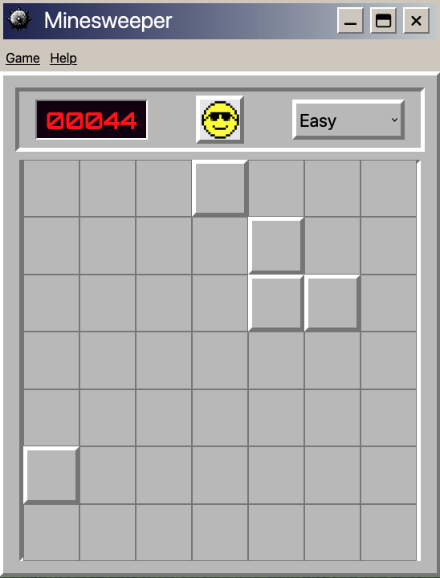

# Minesweeper
Easy minesweeper copy.   

<h2><strong>THE GAME:</strong></h2>
The rules of the game are a little easier than the old windows game minesweeper. In this version there are no numbers telling you how many bombs are around you, but instead you should only count on your luck to avoid the mines.  
 
 
To play the game you must select the difficulty, that can be hard (100 cells and 16 bombs), medium (81 cells and 8 bombs) or easy(49 cells and 5 bombs), and then push the smiley button.
 
 

 
 
<ul>
<li>If you step on a mine you will loose, killing the smile and showing all the mines</li>
<li>If you avoid a mine you can continue and your points will increase</li>
<li>If you open all the cells avoiding all the mines, you will win the game</li>
</ul>
 

 
<h3><strong>Have fun!</strong></h3>